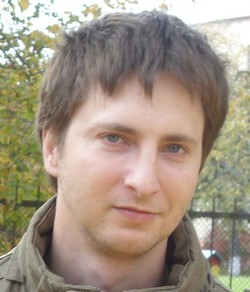

# VLADIMIR RESHITNIK
***
## Contacts
***
- Location: Polotsk, Belarus
- Phone: +375 29 755 88 11
- Email: [reshitnik@gmail.com](reshitnik@gmail.com)
- GitHub: [reshitnik](https://github.com/reshitnik)
- Discord: the_vladimir(@reshitnik)
***
## About me
I have a strong and mature  personality with clearly defined aims. Don’t give up or get discouraged.
***
## Skills
- **IT:**
   + Python basic, MySQL basic, html, css
- **Management:**
  + Contracts of purchase, service contracts, lease arrangements. Team management 
***
## Code Example
```
function testFactorial(a) {
    var x;
    var b=1;
    for (i=1; i<a; i=i+1) {
        x = b*i;
        b = x;
    }
    return x;
} 
```
***
## Experience
- ***2019-Present day***
 Engineer of the first category of instrumentation and telecommunication for Joint Stock Company “Gomeltransneft Druzhba”
**Responsibilities:**
  + Telecommunication service contracting with «Beltelecom», «Best», «MTS», «Zapadtransnefteprodukt», «Zapadtelecomnefteprodukt».
  + Property lease contracting with  «Beltelecom», «Best», «MTS», «Zapadtransnefteprodukt», «Zapadtelecomnefteprodukt». 
  + Documents maintaining for management and control of telecommunication tasks performance.
  + Management of property and land lot issues.
  + Contributing to the construction project  of optical fiber communication line in Vitebsk and Mogilev region. 
  + 2021 - 2022 I am taking courses on the Python Developer program in Skillbox. 
  + 2023 until today I am taking course jn  JS frontend stage 0
- ***2009-2019***
Engineer of the first category of Telecommunication Networks Operational Management Bureau for Joint Stock Company “Polotsktransneft Druzhba”
**Responsibilities**:
  + Telecommunication service contracting with «Beltelecom», «Best», «MTS», «Zapadtransnefteprodukt», «Zapadtelecomnefteprodukt».
  + Property lease contracting with with «Beltelecom», «Best», «MTS», «Zapadtransnefteprodukt», «Zapadtelecomnefteprodukt». 
  + Documents maintaining for management and control of telecommunication tasks performance.
  + Management of property and land lot issues.
  + Telecommunication systems upgrading projects control
  + Equipment purchasing
***
## Education
- Electronics Engineer PSU 2004-2009
- Python-development Skillbox Python Basic courses. Successfully completed the course and got a diploma in «Python Basic», wrote diploma thesis on Telegram-bot  for  hotel search. 
- Skillbox MySql courses. Completed.
- Skillbox  Basic  coding (html,css) courses. Completed.
***

##My project
[My cv](https://reshitnik.github.io/rsschool-cv/cv)
***
## Language proficiency
Russian – native, English – Intermediate.


